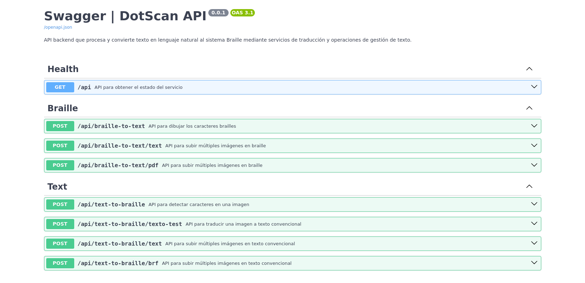

# API de Backend de DotScan


Una API de backend robusta y escalable para el proyecto DotScan, diseñada para facilitar el procesamiento de braille y texto. Este servicio proporciona endpoints para convertir imágenes braille a texto y texto a braille, aprovechando modelos de aprendizaje automático para la inferencia.



## Características

- **Conversión de Braille a Texto**: Utiliza modelos de aprendizaje automático (por ejemplo, YOLO) para detectar e interpretar braille de imágenes, convirtiéndolo en texto legible.
- **Conversión de Texto a Braille**: Transforma la entrada de texto estándar en representaciones braille.
- **API RESTful**: Construida con FastAPI, ofreciendo un alto rendimiento y endpoints de API fáciles de usar.
- **Contenedorizada**: Completamente Dockerizada para entornos de desarrollo, pruebas y producción consistentes.
- **Configurable**: Las variables de entorno (a través de `.env`) permiten una configuración flexible.
- **Verificación de Salud**: Endpoint dedicado para monitorear el estado del servicio.

## Cómo Empezar

Siga estas instrucciones para configurar y ejecutar el proyecto localmente.

### Prerrequisitos

Asegúrese de tener lo siguiente instalado en su sistema:

- [Docker](https://www.docker.com/get-started)

### Instalación rapida

1.  Clone el repositorio (si aún no lo ha hecho):

    ```bash
    git clone https://github.com/Troy8203/Dotscan-back.git
    cd dotscan-backend
    ```

2.  Cree un archivo `.env` copiando la plantilla proporcionada y personalice las variables si es necesario.

    ```bash
    cp .env.template .env
    ```

3.  Construya la imagen de Docker:

    ```bash
    docker build -t dotscan-backend .
    ```

4.  Ejecute el contenedor de Docker:

    ```bash
    docker run -p 8080:8080 dotscan-backend
    ```

    Este comando iniciará la aplicación FastAPI, en el puerto 8080, y puede acceder a la documentación de la API en `http://localhost:8080/docs`.

## Estructura del Proyecto

```
.
├── 📁 app/                     # Código fuente principal de la aplicación
│   ├── 📁 core/                # Utilidades, registro y seguridad
│   ├── 📁 models/              # Modelos de aprendizaje automático y lógica de inferencia
│   ├── 📁 routers/             # Definiciones de endpoints de la API
│   ├── 📁 services/            # Lógica de negocio para los endpoints
│   └── 📁 utils/               # Funciones de ayuda
│   ├── 📄 main.py              # Configuración de la aplicación FastAPI
└── 📁 test/                    # Pruebas de carga
├── 📄 .env.template            # Ejemplo de variables de entorno
├── 📄 Dockerfile               # Configuración de Docker para la aplicación
├── 📄 README.md                # Documentación del proyecto
├── 📄 requirements.txt         # Dependencias de Python
├── 📄 run.py                   # Punto de entrada para la aplicación
```
